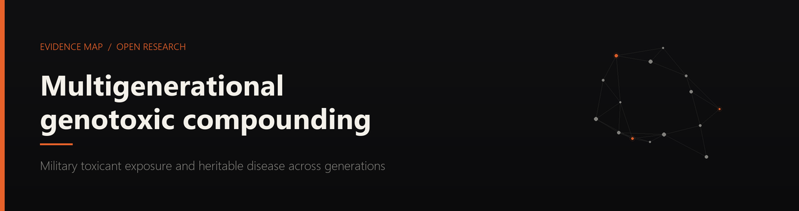

<div align="center">



<br>


**[Read the map](#what-this-is)** · **[How evidence is graded](#how-evidence-is-graded)** · **[Run it locally](#run-it-locally)** · **[Add evidence](CONTRIBUTING.md)** · **[Cite it](#citing-this-work)**

</div>

<br>


## What this is

A parent or grandparent worked in nuclear energy, aerospace, chemical manufacturing, or military service. They were exposed to some combination of ionizing radiation, hexavalent chromium, ammonium perchlorate, hydrazine-based rocket fuel, dioxin (Agent Orange), and naturally occurring asbestos. Their children or grandchildren now carry a cluster of conditions that no single diagnosis explains.

This document answers two questions:

> **1. Are these conditions connected to each other?**
>
> **2. Could parental occupational exposure have caused or contributed to them?**

The answer to both, supported by published peer-reviewed research, is **yes**. The diseases share overlapping molecular pathways — mTOR, Ras-MAPK, Wnt, Sonic Hedgehog — and the exposures damage DNA through mechanisms known to disrupt those exact pathways.

It is a single self-contained web page. No framework, no CDN, no analytics, no cookie banner. Open it on a hospital waiting-room phone with two bars of signal and it works.

<br>


## Three interactive visualizations

| | Figure | What it does |
|:--:|---|---|
| **01** | **Disease network** | 16 conditions as nodes, joined by colour-coded edges representing the biological pathway that links them. Click a node for a plain-language description; click an edge for the published research behind that specific connection; click a legend entry to isolate one pathway. |
| **02** | **Exposure pathways** | A tabbed radial diagram, one tab per toxicant. Selecting a tab draws lines from that exposure to every disease it is linked to. Line thickness and colour encode evidence strength. |
| **03** | **Multi-hit convergence** | A static flowchart of the whole chain: toxicants → three damage routes → inherited genetic vulnerability → disease clusters. Knudson's two-hit hypothesis, extended to combined occupational and inherited risk. |

Every figure is keyboard-operable and carries an SVG `<title>` and `<desc>` for screen readers.

<details>
<summary><b>The eight toxicants covered</b></summary>

<br>

| Substance | Mechanism of genetic damage |
|---|---|
| **Dioxin / TCDD** (Agent Orange) | Binds the AhR receptor, reprograms gene activity, alters methylation tags that pass to children and grandchildren |
| **Hexavalent chromium** Cr(VI) | Enters cells disguised as sulfate, reduces intracellularly, crosslinks the DNA strand and jams replication |
| **Ionizing radiation** | Double-strand breaks; repair stitches the strand back with pieces missing or rearranged |
| **Hydrazine / UDMH** | Alkylating agent — sticks methyl groups onto DNA bases, causing permanent mispairing |
| **Ammonium perchlorate** | Blocks the sodium-iodide symporter; suppresses fetal thyroid hormone during neural tube closure and white matter formation |
| **Naturally occurring asbestos** | Indestructible intracellular fibres drive a permanent NF-κB inflammatory response and chronic ROS damage |
| **TCE / PCE** (chlorinated solvents) | Metabolised into reactive intermediates that bind DNA; cross the placenta efficiently. The Camp Lejeune contaminants |
| **Burn pits** (PM2.5, VOCs, dioxins) | Incomplete combustion of chlorinated plastics generates dioxins; fine particles cross from lung into bloodstream |

</details>

<details>
<summary><b>The written sections</b></summary>

<br>

| Section | Content |
|---|---|
| Pathophysiological convergence | Molecular pathway overlap between all 16 conditions |
| Damage per toxicant | Mechanism of action for each substance at the cellular level |
| Multigenerational compounding | How combined exposures and inherited mutations stack |
| Molecular mechanisms of mutagenesis | Cr(VI) crosslinks, radiation DSBs, AhR reprogramming, hydrazine alkylation, perchlorate thyroid blockade, asbestos NF-κB |
| In utero and developmental implications | Embryonic replication vulnerability, paternal sperm damage, transgenerational epigenetic inheritance |
| Potential comorbidities | Cardiovascular, endocrine/metabolic, auditory/peripheral nerve, secondary malignancy, neuropsychiatric |
| Treatments | mTOR inhibitors, MEK inhibitors, bevacizumab, gene therapy pipeline, IIH management, endometriosis, dystrophic scoliosis, fetal myelomeningocele repair |
| Where these exposures happened | Installation index: Camp Lejeune, Santa Susana / Rocketdyne, Hanford, Rocky Flats, Nevada Test Site, DOE sites, South West Asia burn pits |
| What do I do now | Documenting a decades-old exposure, which tests to ask for, filing a VA claim, the nexus letter, registries, talking to a doctor |
| Legal resources | PACT Act, VA presumptives, Camp Lejeune Justice Act, toxic tort, SSFL/Rocketdyne case law |
| Financial assistance | Disease foundations, trial enrollment, manufacturer patient assistance programs |
| Glossary | Plain-language definitions of every technical term used |
| How this was compiled | Method, evidence grading, stated limits, corrections policy |
| References | 37 cited publications, 31 with direct PubMed links |

</details>

<br>


## How evidence is graded

Nothing on this page is asserted without a grade. Every exposure-to-disease link carries one of three ratings, encoded visually and stated in text.

| | Rating | Criteria | Encoding |
|:--:|---|---|---|
| 🔴 | **Strong** | Large cohort studies, meta-analyses, or VA-recognized presumptive service connections | Red, thick |
| 🟠 | **Moderate** | Smaller cohort studies, animal studies with dose-response, consistent case series | Orange, medium |
| 🔵 | **Emerging** | Case reports, animal-only data, biological plausibility without large human studies | Blue, thin |

> [!IMPORTANT]
> A **strong** rating means the evidence is strong. It does not mean a given individual's disease was caused by a given exposure. Causation in an individual case is a clinical and legal determination, not an epidemiological one.

<details>
<summary><b>Selected references</b></summary>

<br>

- **Brook-Carter et al. (1994)** — TSC2/PKD1 contiguous gene deletion syndrome
- **Manikkam et al. (2012)** — Dioxin transgenerational epigenetic inheritance, three generations deep
- **Rier et al. (1993)** — Dioxin dose-dependent endometriosis in rhesus monkeys
- **Preston et al. (2007)** — Solid cancer incidence in atomic bomb survivors, 1958–1998
- **Cardis et al. (2005)** — Thyroid cancer risk after I-131 exposure in childhood
- **Adzick et al. (2011)** — MOMS trial, prenatal vs postnatal myelomeningocele repair
- **Wall et al. (2014)** — IIHTT trial, acetazolamide in idiopathic intracranial hypertension
- **Rasmussen et al. (2001)** — Mortality in neurofibromatosis 1
- **National Academies (2018)** — Veterans and Agent Orange: Update 11

The full list with PubMed links lives in the document itself.

</details>

<br>


## Run it locally

No install step. No package manager. Open the file.

```bash
git clone https://github.com/danieljtrujillo/military-chemical-exposure-and-multigenerational-genotoxic-compounding.git
cd military-chemical-exposure-and-multigenerational-genotoxic-compounding
```

```bash
# Serve the source with any static server
npx serve src
# or
python -m http.server 8000 --directory src
```

### Building

`src/` is the source of truth. The build inlines the stylesheet and script into one self-contained document and copies the static files alongside it.

```bash
node tools/build.js      # -> dist/  (Node standard library only, no deps)
```

### Testing

The content is structured objects with no schema, so these assertions are what
stands between a typo and a silently broken diagram:

```bash
node tools/test-data.js
```

It checks that every edge endpoint and every exposure target resolves to a real
condition, that no pathway is defined without edges (an unused one renders a
legend filter that blanks the graph), that no circles overlap, and that nothing
falls outside the viewBox. Editorial gaps are reported as warnings rather than
failures. CI runs it on every push and pull request.

Regenerating the social card, icons and README banner needs Pillow, and is only necessary if you change the palette or the title:

```bash
pip install pillow
python tools/make_assets.py
```

Pushing to `main` builds and publishes `dist/` via [`.github/workflows/deploy.yml`](.github/workflows/deploy.yml).
A second workflow sweeps every outbound link monthly and opens an issue when one dies.

### Changing the domain

Every absolute URL on the site derives from one constant. Edit `DEFAULT_SITE_URL`
in [`tools/build.js`](tools/build.js), or override it per build:

```bash
SITE_URL=https://your-domain.org node tools/build.js
```

That rewrites the canonical tag, `og:url`, both social images, `robots.txt`, the
sitemap and every `@id` in the JSON-LD graph.

### Project structure

```
├── src/                       Source of truth
│   ├── index.html             Document, metadata, SVG containers
│   ├── script.js              Starfield + network + exposure diagrams
│   ├── style.css              Stylesheet, CSS custom properties
│   ├── og-image.png           Social card
│   ├── favicon.svg            Icon
│   ├── robots.txt             Crawl directives
│   ├── sitemap.xml            Sitemap
│   ├── site.webmanifest       PWA manifest
│   └── humans.txt             Colophon
├── dist/                      Build output — self-contained, deployable
├── tools/
│   ├── build.js               Inlines src/ into dist/, owns the canonical URL
│   ├── test-data.js           Data-integrity checks
│   └── make_assets.py         Generates banner, social card, icons
├── docs/
│   ├── AUDIT.md               Expansion and overhaul roadmap
│   └── SEO.md                 Search strategy
└── .github/workflows/         Pages deployment
```

<br>


## How the data is shaped

All content is structured JavaScript objects in [`src/script.js`](src/script.js). There is no database and no fetch.

<details>
<summary><b>Disease node</b></summary>

```js
{
  id: 'tsc',
  label: 'Tuberous sclerosis',
  x: 200, y: 160, r: 22,        // SVG position and collision radius
  cat: 'genetic',               // genetic | neoplastic | neuro | structural | inflammatory
  desc: 'Tuberous sclerosis complex (TSC) is a genetic disorder caused by…'
}
```

</details>

<details>
<summary><b>Pathway edge</b></summary>

```js
{
  from: 'tsc',
  to: 'pkd',
  path: 'chr16',                // a key of the `pathways` map
  info: 'The TSC2 gene and the PKD1 gene are right next to each other…'
}
```

Pathway keys: `mtor` · `chr16` · `phako` · `neural` · `inflam` · `struct` · `endocrine` · `icp`.
The legend renders only pathways that have at least one edge, so an unused key never becomes a filter that blanks the graph.

</details>

<details>
<summary><b>Exposure</b></summary>

```js
{
  id: 'ao',
  short: 'Agent Orange (Dioxin / TCDD)',
  mechanism: 'Binds the AhR receptor inside cells…',
  targets: [
    { d: 'spina', name: 'Spina bifida', strength: 'strong', note: 'VA-recognized presumptive…' }
  ]
}
```

`d` is the condition's node `id`, which is what joins Figure 2 to Figure 1 —
they were once joined by display string, which drifted apart as labels were
edited. `name` is display text only. `strength` is `strong`, `moderate` or
`emerging`.

</details>

Adding a condition, an exposure or a citation means editing one array. See [CONTRIBUTING.md](CONTRIBUTING.md) for the evidence bar a new link has to clear.

<br>


## Citing this work

Machine-readable metadata is in [`CITATION.cff`](CITATION.cff); GitHub's *Cite this repository* button reads it directly.

## Browser support

Chrome, Firefox, Safari and Edge, current versions. Requires JavaScript for the diagrams; all prose, references and resource links are in the HTML and readable without it. Honours `prefers-reduced-motion` — the starfield never starts for visitors who have asked for less motion. Prints cleanly to PDF with every accordion expanded and every link footnoted.

## Disclaimer

> [!WARNING]
> This is an informational research reference, **not medical or legal advice**. Bring it to a geneticist, an occupational medicine specialist, or a VA claims attorney who can apply it to a specific case. Clinical trial status and legal landscapes change — verify links before relying on them.

## License

[MIT](LICENSE.txt). Use it, fork it, translate it, print it and hand it to a doctor.

<br>

---

<div align="center">
<sub>

Built and maintained at **[GANTASMO](https://gantasmo.com)** · Las Vegas

For the veterans, plant workers and families whose case histories are the reason this page exists.

</sub>
</div>
