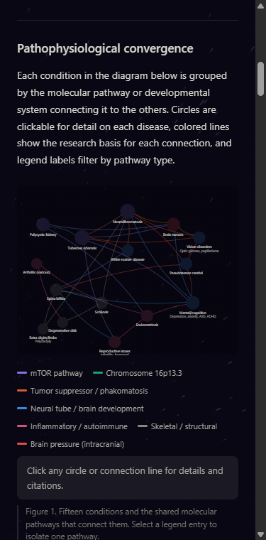

# Expansion, overhaul and update roadmap

A sweep of the site as it stands, and what to do about it. Findings are ordered by
impact, and each one says how big the job is. Items marked **✅ done** were fixed in
the pass that produced this document; everything else is a recommendation.

**Audit date:** 2026-09-07 · **Second pass:** 2026-09-07 · **Third pass:** 2026-09-08

**Current build:** `dist/index.html`, 179 KB, 16 conditions, 8 toxicants, 36 mapped connections, 37 citations, 678 data-integrity checks passing

---

## 0. The thing that blocks everything else

> [!CAUTION]
> **There is no deployed site.** GitHub Pages is off for this repository
> (`has_pages: false`), the repo has no homepage URL, no description, and no topics.
> Every SEO recommendation in [SEO.md](SEO.md) is worth nothing until the page has a
> public address.

`dist/` also contained an unrelated CodePen starfield demo titled *"Space Journey"* —
not a build of this project. Anyone who had pointed Pages at `/dist` would have shipped
a blank animated background.

**✅ Done:** `dist/` is now a real self-contained build produced by
[`tools/build.js`](../tools/build.js), and [`.github/workflows/deploy.yml`](../.github/workflows/deploy.yml)
publishes it on every push to `main`.

**You still need to:** open **Settings → Pages → Source → GitHub Actions**, then set the
repo description, homepage and topics. Three minutes, and it unblocks the entire SEO plan.

If the site is already deployed somewhere other than GitHub Pages, point
`DEFAULT_SITE_URL` in [`tools/build.js`](../tools/build.js) at the real address
and rebuild. Every canonical, social and JSON-LD URL follows from that one constant.

---

## 1. Critical — fix before promoting the page

### 1.1 The diagrams are illegible on a phone

Measured at a 375 px viewport: the network SVG renders **312 px wide**, scaling its
`viewBox` from 680 px. The 11 px node labels come out at **≈5 px** of rendered type.
They are not small. They are unreadable.

This matters more than any other defect on the page, because the audience — a parent
reading in a waiting room, a veteran on a phone plan — is overwhelmingly mobile, and the
diagrams are the reason the page exists.

**Fix:** below ~600 px, stop trying to render a 680 px canvas. Options, best first:

1. **Swap the layout, don't shrink it.** Ship a second node-position table for narrow
   screens (a vertical or two-column arrangement with a taller `viewBox`), selected at
   render time from `matchMedia('(max-width: 600px)')`. The data model already separates
   position from content, so this is a table, not a rewrite.
2. **Give the SVG a minimum width and let it scroll horizontally** inside an
   `overflow-x: auto` container. Cheap, but horizontal scrolling on a reading page is a
   poor consolation.
3. **Offer a list view.** Below the breakpoint, render the same data as an accordion of
   conditions and their connections. This doubles as the text alternative that helps
   both screen readers and search engines (see §5).

**✅ Done — option 3.** Below 700 px the diagram and its legend are hidden and the
page renders *Every condition and connection, in full*: an accordion carrying all 16
condition descriptions and all 72 connection entries, each with its pathway and the
published evidence. It is always in the DOM, so it is simultaneously the mobile view,
the screen-reader alternative, and indexable text — page text went from 17,555 to
23,235 characters as a result.

**✅ Compacted further (third pass).** Sixteen full-width accordion rows cost roughly
700px of scroll even collapsed. The same sixteen now render as an equal-width tile grid
— **163px on desktop** at four across, **329px on mobile** at two across — and selecting
one opens a modal rather than pushing the rest of the page down.

No content was cut. Every condition still renders a full article into a hidden container
that is what the modal displays, what screen readers reach, what prints, and what a
crawler indexes; 16 articles and all 72 connection entries remain in the DOM. Labels wrap
rather than truncate, so no condition name is ever clipped. Deep links such as
`#condition-endo` open the modal directly, cross-references inside it swap condition
without closing, and focus returns to the tile that opened it.

Option 1, a second node-position table for narrow screens, is still worth doing if you
want the picture rather than the text on a phone. It is no longer urgent.

 

### 1.2 Small text fails the contrast floor

Measured against the painted backdrop:

| Token | Value | Contrast | Verdict |
|---|---|--:|---|
| `--text-primary` | `#d8d6cf` | 13.13 | Pass |
| `--text-secondary` | `#a8a69e` | 7.83 | Pass |
| **`--text-tertiary`** (was) | `#7a786f` | 4.31 | Failed AA |
| **`--text-tertiary`** (now) | **`#8e8c83`** | **5.66** | **Pass** |
| `--accent` | `#E8622A` | 5.65 | Pass |

`--text-tertiary` is used for the footer, the colophon and figure captions — all at
11–12 px, where the standard is strictest.

**✅ Done.** Lifted to `#8e8c83`, re-measured at 5.66:1, no perceptible change to the
look of the page.

### 1.3 Source encoding was corrupted

`src/index.html` carried a UTF-8 BOM and six mojibake sequences (`â€"` where an em dash
belonged, `·`, `§`) — the signature of a UTF-8 file opened and re-saved as Windows-1252.

**✅ Done.** BOM stripped, all six repaired, and a [`.gitattributes`](../.gitattributes)
now pins `working-tree-encoding=UTF-8` and `eol=lf` across the source so an editor
re-saving as ANSI cannot reintroduce it.

### 1.4 A legend filter that blanked the graph

`pathways` defined `endocrine` ("Hormone disruption") and the legend rendered a swatch
for it, but **no edge in the graph used it**. Clicking it dimmed all 31 edges to nothing,
with no indication why.

**✅ Done** — the legend renders only pathways that have at least one edge, and
[`tools/test-data.js`](../tools/test-data.js) now fails the build if a pathway is
ever defined without one again.

That was the code fix. The content fix is §2.1, which is also now done, so the
“Hormone disruption” filter is back in the legend and working.

---

## 2. Content expansion — the highest-value work

### 2.1 Hormone disruption is described but never mapped

The prose explains at length how perchlorate suppresses fetal thyroid hormone, and how
that affects neural tube closure, white matter formation and cognition. The graph does
not encode any of it, which is why `endocrine` had no edges.

**✅ Done.** A `thyroid` node (thyroid dysfunction) now connects by the `endocrine`
pathway to white matter disease, spina bifida, cognition, reproductive issues and
endometriosis — five edges where there were none. Two citations were added to support
them: Haddow et al. (1999) for the 7-point IQ deficit in children of untreated
hypothyroid mothers, and Sinaii et al. (2002) for the thyroid–endometriosis
co-occurrence. Both verified against PubMed.

### 2.2 Missing exposures the audience is actually searching for

Six toxicants are covered. These are absent, and each one is a large, motivated audience:

| Missing | Why it matters |
|---|---|
| **TCE and PCE** (trichloroethylene, perchloroethylene) | These are *the* Camp Lejeune contaminants. The page discusses the Camp Lejeune Justice Act in its legal section but never lists the chemicals that made it necessary. This is the most conspicuous gap in the document. |
| **Burn pits / PM2.5 and VOCs** | The largest cohort the PACT Act covers, and the reason most people have heard of the PACT Act at all. Currently absent. |
| **PFAS / AFFF firefighting foam** | Active nationwide litigation, DoD installation testing, established endocrine and developmental effects. |
| **JP-8 jet fuel, benzene and solvents** | Benzene appears once, in a comorbidity aside. It deserves an exposure entry. |
| **Depleted uranium** | Gulf War and Balkans cohorts; chemical nephrotoxicity as well as radiological. |
| **Lead** | Ranges, paint, older housing stock on installations. |

**✅ Done — TCE/PCE and burn pits.** Both are now full exposures with mechanisms and
graded targets, taking the page from six toxicants to eight.

TCE/PCE is graded against ATSDR’s own findings and Ruckart et al. (2013), a case-control
study of 12,493 children born at Camp Lejeune between 1968 and 1985, which is the
best-characterised exposure-to-birth-defect dataset on the page. Burn pits are graded
**emerging** almost throughout, deliberately: the PACT Act presumptive list is built
around disease in the veteran, and effects in their children are essentially unstudied.
Saying so is more useful than inflating the grade.

**Still open:** PFAS/AFFF, JP-8 and benzene as a first-class exposure, depleted uranium,
lead. *Effort: medium each.*

### 2.3 There is no "what do I do now"

The page ends with resources but never gives an **action path**. For its audience this is
the most useful thing it could add, and in search terms it is the strongest asset the
page could hold. A new section covering:

- How to document an exposure that ended forty years ago — personnel records, DD-214,
  dosimetry badge records, industrial hygiene reports, SF-180 requests, unit histories
- Which tests to ask for, and what to say to get them ordered — genetic panels for
  TSC1/TSC2, NF1, PKD1/PKD2; when whole-exome is justified; baseline imaging
- How to file: VA intent-to-file, evidence a claim needs, the nexus letter and who writes it
- Which registries to join — VA Airborne Hazards and Open Burn Pit Registry, ATSDR
  registries, the disease foundation patient registries
- What to tell your children's paediatrician

**✅ Done.** Added as *What do I do now?* with five sections: documenting a decades-old
exposure (SF-180, personnel files, dosimetry, EEOICPA dose reconstruction, residence
records), which tests to ask for and how to get them ordered, filing a VA claim and what
a nexus letter has to say, which registries to join, and how to talk to a doctor without
being filed under parental anxiety.

### 2.4 No site or installation index

People do not search for "ammonium perchlorate genotoxicity". They search for
**"Santa Susana Field Lab cancer"**, **"Hanford downwinders"**, **"Camp Lejeune water"**,
**"Rocky Flats"**, **"Nevada Test Site fallout"**.

A section indexing known contaminated installations and plants — what was released, when,
who was exposed, which registry or benefit applies, and which of this page's exposures map
to it — would be both genuinely useful and the single best-performing thing on the site.
Start with SSFL/Rocketdyne, Camp Lejeune, Hanford, Rocky Flats, Fernald, Oak Ridge,
Paducah, Portsmouth, the Nevada Test Site, Hunters Point, McClellan and Kirtland.

**✅ Done — first seven.** Added as *Where these exposures happened*: Camp Lejeune,
Santa Susana / Rocketdyne, Hanford, Rocky Flats, the Nevada Test Site, the other DOE
sites as a group, and South West Asia burn pits. Each gives what happened, when, why it
matters to this page specifically, and the official source. Contamination figures are
cited to ATSDR and DOE rather than asserted.

**Still open:** Hunters Point, McClellan, Kirtland, and one page per site once the
hub-and-spoke split in [SEO.md](SEO.md) §2.1 happens.

### 2.5 The comorbidity section is prose only

Five substantial accordions of cardiovascular, endocrine, auditory, malignancy and
neuropsychiatric risk — none of it visualized, none of it in the network. Either promote
the strongest comorbidities to nodes, or give the section its own compact risk-matrix
figure. *Effort: medium.*

### 2.6 Smaller content gaps

- **✅ Glossary added** — 18 terms in the order a reader meets them, from *genotoxic*
  and *teratogen* through *Knudson’s two-hit hypothesis* to *nexus letter*.
- **No per-claim review dates.** "Links verified March 2026" covers the whole document.
  Trial status changes per drug. Put a `lastReviewed` on the treatment entries.
- **No non-US resources.** Australian, Canadian, UK and Korean veterans have Agent Orange
  provisions. Currently invisible to all of them.
- **Nothing on genetic counselling or reproductive options** — preimplantation testing,
  donor gametes, prenatal diagnosis. Families reading a page about heritable disease are
  asking this question, and the page does not acknowledge it.
- **No printable one-pager** for handing to a physician. The print stylesheet added in
  this pass makes the full document print cleanly; a deliberate one-page summary would be
  better.

---

## 3. Graphics overhaul

### 3.1 Node positions are hand-placed constants

Every node carries hard-coded `x`/`y`. It works at 15 nodes; it becomes a repositioning
puzzle the moment §2.1 and §2.2 add more. Either adopt a small force simulation
(~40 lines, no dependency) or move the layout into a named table per breakpoint so it is
data rather than magic numbers. *Effort: medium.*

### 3.2 Colour carries two different meanings

In Figure 1, red/orange/blue encode **pathway identity**. In Figure 2, red/orange/blue
encode **evidence strength**. A reader who learns one legend will misread the other.
Give the two figures visibly different palettes, or move evidence strength onto a
non-colour channel — line weight is already doing the work, so dash pattern or an explicit
badge could carry the rest.

Also check `#1D9E75` (green) against `#E24B4A` (red) for deuteranopia: that pair is the
classic failure case, and it currently distinguishes "Chromosome 16p13.3" from
"Brain pressure". *Effort: small.*

### 3.3 The starfield is not density-aware

**✅ Done.** The backing store is now multiplied by `min(devicePixelRatio, 2)` with the
context scaled to match — sharp on high-DPI displays, and capped so a 3x phone does not
pay triple fill cost for a background nobody looks at directly.

**✅ Already done** in this pass: the loop moved from `setInterval` to
`requestAnimationFrame`, stops when the tab is hidden, and never starts for visitors who
have asked for reduced motion.

### 3.4 Figure 3 is hand-placed SVG

The convergence model is hand-written `<rect>` and `<line>` elements with absolute
coordinates. Any content change means recomputing geometry by hand — which is exactly
what happened: adding TCE/PCE and burn pits in the second pass left Figure 3 still
showing only five toxicants, because it is not driven by the same data as Figures 1
and 2.

**✅ Fixed (third pass).** Figure 3 now shows all seven toxicant groups with the
toxicant-to-damage-route arrows intact: 15, up from the original 9.

An intermediate version of this fix collapsed those 9 arrows into 3 from a grouped
band, on the reasoning that Figure 2 already carried the detail. That reasoning was
wrong. Figure 2 maps toxicant to *disease*; the toxicant to *damage route* mapping
exists only here, and losing it erased the page's sharpest point — that ammonium
perchlorate reaches hormone disruption **only**, never mutagenesis, because it does not
damage DNA at all. The arrows are restored.

One arrow is new rather than restored: dioxin now also reaches hormone disruption,
which its own mechanism text ("disrupts estrogen and androgen signaling") and its
endometriosis and thyroid links already support.

**Still open:** it is still hand-placed, so it can still drift out of step with the data.
Generating it from a tier/box structure in `script.js` remains the real fix. *Effort:
medium.*

### 3.5 Graphics worth adding

- **A generational timeline.** Exposure era → parent → child → grandchild, with latency
  windows. Nothing currently shows *time*, and time is the entire argument.
- **A body-map figure** for the comorbidity section — far more scannable than five accordions.
- **A dose-and-latency chart** per exposure, where data supports it.
- **A "which of these do you have?" checklist** that highlights the matching subgraph.
  High engagement, highly shareable, and it turns a document into a tool.

---

## 4. Technical and structural

**✅ Done in this pass:**

- Real build pipeline (`tools/build.js`) and Pages workflow
- Reproducible imagery generator (`tools/make_assets.py`)
- Full metadata head: description, canonical, Open Graph, Twitter card, JSON-LD
  (`MedicalWebPage` + `WebSite` + `Organization`)
- `robots.txt`, `sitemap.xml`, `site.webmanifest`, `favicon.svg`, `humans.txt`,
  social card, app icons
- Semantic landmarks (`<main>`, `<footer>`, `<figure>`/`<figcaption>`), skip link
- Print stylesheet — accordions expanded, links footnoted with their URLs
- Keyboard operability and ARIA on all 46 interactive SVG elements

**Still open:**

- **✅ The stale root duplicate is gone** — removed by the author.
- **✅ `<noscript>` added** to the two script-driven figures, pointing readers at the
  text that carries the same content.
- **✅ Tests added.** [`tools/test-data.js`](../tools/test-data.js) runs 678 checks with
  no dependencies: every edge endpoint and exposure target resolves to a real condition,
  every pathway resolves, no pathway is unused, no circles overlap, nothing escapes the
  viewBox, no duplicate edges, no orphan nodes. Editorial gaps are warnings rather than
  failures. It runs in CI on every push and pull request.

  It found a real latent bug on first run: Figures 1 and 2 were joined by **display
  string**, and 18 of those strings had drifted apart (`Mental / cognitive` versus
  `Mental/cognitive`, `Polycystic kidney disease` versus `Polycystic kidney`). Targets
  now carry a node `id`. The same run also showed `rad` lumping TSC and NF into one
  target, so NF was unreachable from any exposure — now split into two.
- **✅ Monthly link checker.** [`.github/workflows/links.yml`](../.github/workflows/links.yml)
  sweeps all 78 outbound links on the first of each month and opens an issue listing any
  that died.
- **✅ One canonical URL.** `DEFAULT_SITE_URL` in `tools/build.js` now drives all 21
  absolute URLs across the HTML, sitemap and robots.txt. Overridable with
  `SITE_URL=... node tools/build.js`.
- **✅ CI runs on Node 24.** It was pinned to Node 20, which reached end of life in
  April 2026 and no longer receives security updates. Now matches the local toolchain.
- **No issue templates.** Low priority, but templates shaped around “report a dead
  resource link” and “propose an evidence link” would channel exactly the contributions
  this project wants. The link checker now files the first kind automatically.
- **Pseudotumor cerebri is not reachable from any exposure.** The integrity test reports
  this as a warning. It is a genuine editorial gap rather than a bug, and it should be
  filled with a real citation or left honestly empty — not papered over.

---

## 5. Accessibility beyond what was fixed

- **✅ Text alternatives for the figures.** The list view from §1.1 gives screen reader
  users the full data, not just a description of the picture.
- **✅ Figure 2 is now keyboard-operable too** — the first pass only fixed Figure 1.
- **Focus order inside the SVGs.** All 46 shapes are now tabbable, which means keyboard
  users traverse 31 edges before reaching the legend. Consider a roving tabindex, or
  making edges reachable only from their connected nodes.
- **Reduced motion is handled; reduced transparency is not.** The layered translucent
  panels over a moving starfield are demanding. Consider `prefers-contrast: more`.
- **Language.** `lang="en"` is set. If translations happen (§2.6), they need `hreflang`.

---

## 6. Resources to verify

Everything below is asserted as "verified March 2026" and should be rechecked before the
page is promoted. 58 unique outbound links, 27 of them PubMed.

| Area | What to check |
|---|---|
| **VA presumptive conditions** | The PACT Act list has been expanded more than once since passage. Verify the current list and add any newly presumptive conditions. |
| **Clinical trials** | Every `clinicaltrials.gov` search link, plus the status of NFX-179, the DCA endometriosis work, and the PKD CRISPR pipeline. |
| **Drug pricing** | Tolvaptan is quoted at "roughly $13,000/month". Verify or drop the figure — a stale price is worse than none. |
| **Attorney referrals** | Three firms are named. Confirm each still practises in this area; consider replacing named firms with bar-association referral services to avoid the appearance of endorsement. |
| **Foundation programs** | Financial assistance programs open and close. Recheck all seven. |
| **Fetal surgery centres** | The MOMS-trial centre list changes. |
| **Dead-link monitoring** | Add [Lychee](https://github.com/lycheeverse/lychee-action) on a monthly schedule so this never has to be a manual sweep again. *Effort: small.* |

---

## Suggested order of work

**Done in the second pass:** the thyroid node and endocrine edges, TCE/PCE and burn pit
exposures, the mobile list view, the action path, the installation index, the glossary,
the methodology section, the data-integrity test, the link checker, canonical-URL
centralisation, dual encoding in Figure 2, DPR scaling, and `<noscript>` fallbacks.

**Done in the third pass:** CI moved off end-of-life Node 20 to Node 24; Figure 3
updated to carry all eight exposures; the condition list compacted from ~700px of
stacked rows to a 163px tile grid with a modal, losing no content.

**What is left, in order:**

| # | Item | Section | Effort |
|:--:|---|:--:|:--:|
| 1 | Turn on GitHub Pages, or point `DEFAULT_SITE_URL` at the real host | §0 | XS |
| 2 | Set repo description, homepage and topics | §0 | XS |
| 3 | Fix the red/green legend pair for deuteranopia | §3.2 | S |
| 4 | Give pseudotumor cerebri an exposure link, or state the gap in the text | §4 | S |
| 5 | Hub-and-spoke page split | [SEO.md](SEO.md) §2.1 | L |
| 6 | Add PFAS/AFFF, JP-8/benzene, depleted uranium, lead | §2.2 | M |
| 7 | Mobile node-position table, so the *picture* works on a phone too | §1.1 | M |
| 8 | Generate Figure 3 from data so it cannot drift again | §3.4 | M |
| 9 | Generational timeline figure | §3.5 | M |
| 10 | Named clinical reviewer + visible changelog | [SEO.md](SEO.md) §3.1 | — |

Items 1 and 2 are the only remaining blockers. Item 10 is not an engineering task and
would do more for a YMYL page than anything else on this list.
